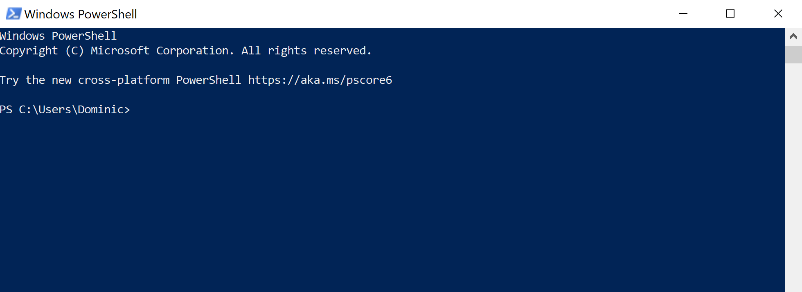
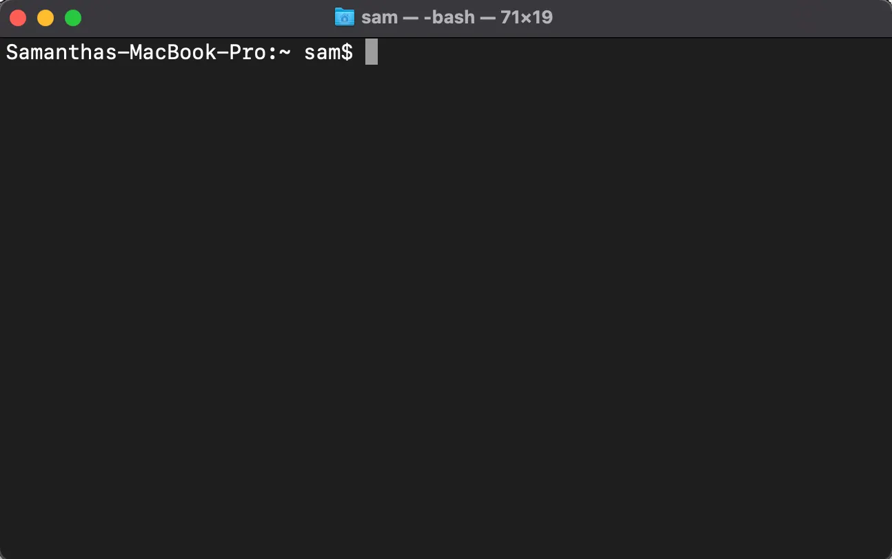
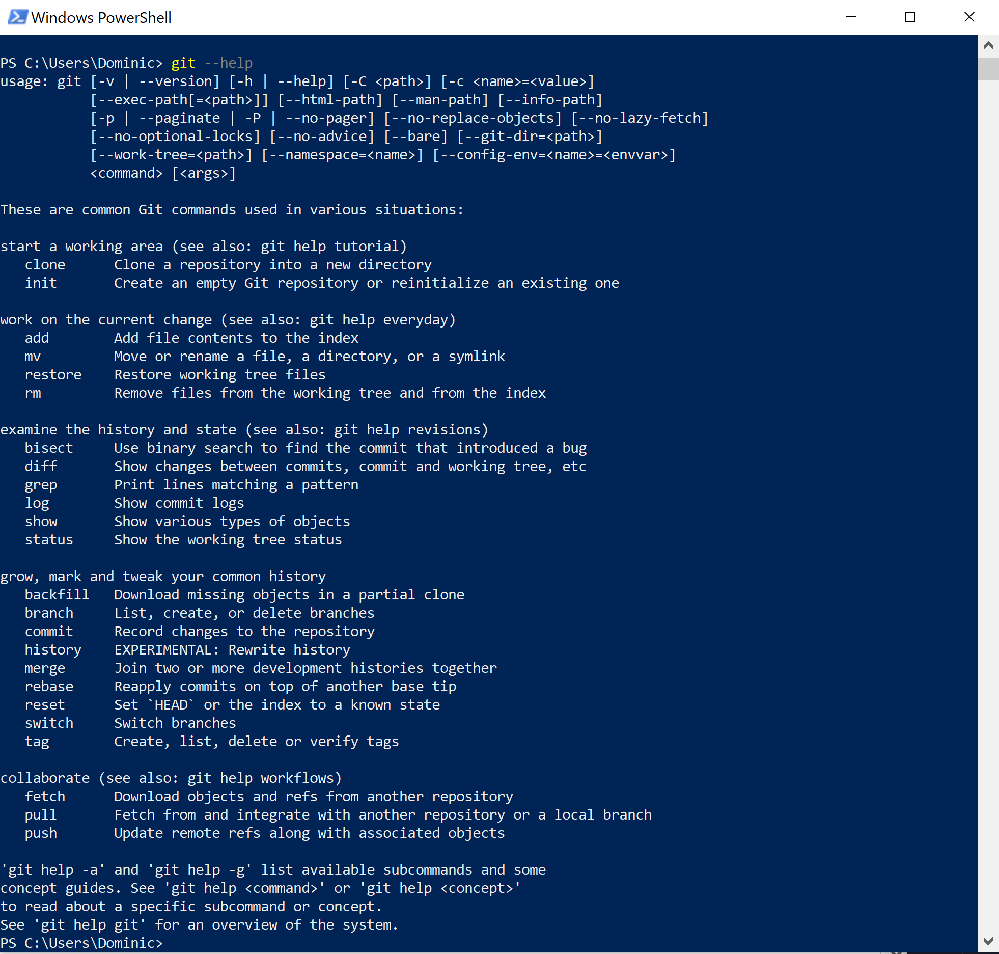
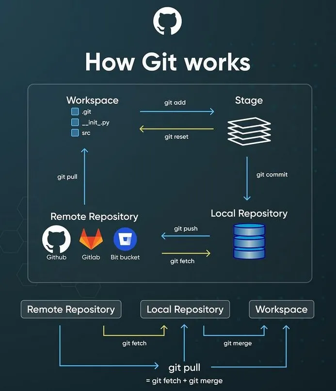

# Welcome to GitHub for Digital Humanities! 
This workshop is given as part of an Intro to Digital Humanities catered towards Master of Library Science students. In this workshop you will learn about the benefits of GitHub, how Git works, and how to download the files on this GitHub repository to your own computer. Additionally, we will show you how digital humanists have used Git/GitHub to share and publish their work online as static webpages hosted or created using GitHub pages.

Much of this workshop is devoted to learning how to clone this repository using the command line on your computer. While many of you may be concerned, don't worry! You will learn a few simple commands that will help you navigate to different files and folders (called directories) on your computer. After we cover these basic commands, you will then be able to clone this repository.

This README is divided into the following sections:
- [What is a README?](#what-is-a-readme)
- [The Command Line](#the-command-line)
	- [How do I get to the command line?](#how-do-i-get-to-the-command-line)
	- [Command line reference](#command-line-reference)
- [Command line reference](#installing-git)
	- [Installing Git on Windows machines](#installing-git-on-windows-machines)
	- [Installing Git on Macs](#installing-git-on-macs)
- [Git Commands](#git-commands)
- [References](#references)
- [Resources](#resources)

Feel free to reference this README throughout this workshop!

# What is a README?
A README is a document created by project developers that create to provide essential information about their projects. They are usually stored as text (.txt) or markdown (.md) files. The file you see here is a markdown file. They allow me to mark up plain text which is rendered here in this file. I can insert links (linking within this document or to a URL), create headings, and insert images, code blocks, and tables all using plain text. The images you see here are stored in a folder in this GitHub repository and when I want to insert it, I provide a link to where the image is store in this repository.

I can even link to the [Google Slides presentation](https://docs.google.com/presentation/d/1M-7CvYWcNbAYxR1pd-Vlye9EqJs41LvprNJEbv2ePw4/edit?usp=sharing)

# The Command Line

## How do I get to the command line?

Windows Users:
- Press the windows key (⊞) and enter "Powershell" in the search bar + press enter
- You should see a blue window like this:
  
  

Mac Users:
- Got to the Spotlight search bar and type "terminal" + enter
  

**Note: While the commands that we will cover in this workshop are the same for both Windows and Mac, commands might different slightly for more advanced or specific tasks.**

## Command line reference

| Command                 | Description                                                                                                                                                                                |
| ----------------------- | ------------------------------------------------------------------------------------------------------------------------------------------------------------------------------------------ |
| `cd <filepath>`         | change current directory – change the folder in which your commands will work      Use “cd ~” to navigate to your home directory   And “cd ~/desktop” to navigate to your desktop |
| `pwd`                   | print working directory – prints out the filepath of the directory you are currently in                                                                                                    |
| `ls`                    | lists the files and directories contained in your current working directory                                                                                                                |
| `git --version`         | Use to check to see if you have Git installed or which version of git you have                                                                                                             |
| `git --clone <url>.git` | Use to download a local copy of a remote repository. Use only once.                                                                                                                        |
| `clear`                 | Clears your terminal window.                                                                                                                                                               |
| ctrl + c (control + c)  | Quits a process that is running.                                                                                                                                                           |

# Installing Git

## Installing Git on Windows Machines

1) Navigate to [https://git-scm.com/install/windows](https://git-scm.com/install/windows)
2) Select “Click here to download” at the top of the page
3) This will take you to a dialog box that will walk you through the installation.

[See detailed instructions](documents/git_install_windows.md)

## Installing Git on Macs

1) In terminal type `xcode-select --install` + return
2) This will take you to a dialog box that will walk you through the installation.

[See detailed instructions](documents/git_install_mac.md)

# Git Commands

When using Git in the command line, if you need help enter `git --help` or `git -h` and press enter/return. `--help` or `-h` is called an **option**. Options helps you specify additional parameters that alters the behavior of the command. Options can be **verbose** denoted by `--` + an option fully spelled out and **brief** `-` + an abbreviation of the option ("help" versus "h")

`git --help` or `git -h` gives you a whole list of commands along with a brief explanation

Entering `git <command> -h` (for instance `git clone -h`) will take you to more extensive documentation

| Command           | Description                                                                                                                   |
| ----------------- | ----------------------------------------------------------------------------------------------------------------------------- |
| `init`            | creates a new repository                                                                                                      |
| `clone <url>.git` | used to download a local copy of a remote repository. Use only once.                                                          |
| `pull`            | used to update the local copy of the repository with changes (“commits”) that other users have made to the remote repository. |
| `commit`          | logs the changes you made to your local repository                                                                            |
| `push`            | takes local changes (created, edited, deleted files) and adds them to the remote repository                                   |

Adhikari, Sujan. (2023, November 20). How Git works: A visual guide with code. Medium.

Use `git clone` in place of `git fetch` the first time you download the remote repository

# References

“1.3 Getting started - What is Git?” (n.d.). Git. Accessed September 20, 2026. [https://git-scm.com/book/en/v2/Getting-Started-What-is-Git%3F](https://git-scm.com/book/en/v2/Getting-Started-What-is-Git%3F)

Adhikari, Sujan. (2023, November 20). How Git works: A visual guide with code. *Medium*. [https://medium.com/@sujanaddy98/how-git-works-a-visual-guide-with-code-b4edf2694298](https://medium.com/@sujanaddy98/how-git-works-a-visual-guide-with-code-b4edf2694298)

Becker, D., Williamson, E., & Wikle, O. (2020). CollectionBuilder-CONTENTdm: Developing a static web ‘skin’ for CONTENTdm-based digital collections. *Code{4}lib Journal, 49*. [https://journal.code4lib.org/articles/15326](https://journal.code4lib.org/articles/15326) 

“Branches.” (2026). [https://docs.github.com/en/pull-requests/reference/branches](https://docs.github.com/en/pull-requests/reference/branches) 

Craig, K., Dalmau, M., & Purcell, S. (2026, March 25). Operationalizing minimal computing values through shared computing-platform development: A case study of DigitalArc and Opaque Publisher.  *In the Library with the Lead Pipe*. [https://www.inthelibrarywiththeleadpipe.org/2026/digitalarc/](https://www.inthelibrarywiththeleadpipe.org/2026/digitalarc/) 

ghostinhershell. (2025, July 25). “Day 1: What is GitHub (and why do people use it)? 🤔.” GitHub. [https://github.com/orgs/community/discussions/167863](https://github.com/orgs/community/discussions/167863)

Koeser, R.S., Budak, N. (2025). mep-django \[Computer software]\. [https://github.com/Princeton-CDH/mep-django](https://github.com/Princeton-CDH/mep-django)

Kotin, J., Koeser, R.S. et al. “Discoveries.” (2021). Shakespeare and Company Project, version 1.10.1. Center for Digital Humanities, Princeton University. [https://shakespeareandco.princeton.edu/discoveries/](https://shakespeareandco.princeton.edu/discoveries/)

Kotin, J., Koeser, R.S. et al. (2025). Shakespeare and company project, version 1.10.1. Center for Digital Humanities, Princeton University. [https://shakespeareandco.princeton.edu/](https://shakespeareandco.princeton.edu/)

“Pull Requests.” (2026). [https://docs.github.com/en/pull-requests/reference/pull-requests](https://docs.github.com/en/pull-requests/reference/pull-requests)

# Resources

“Bash Tutorial.” (2026). W3Schools. [https://www.w3schools.com/bash/index.php](https://www.w3schools.com/bash/index.php) 

“Git Cheat Sheet.” (n.d.). Git. Accessed September 20, 2026. https://git-scm.com/cheat-sheet

“GitHub Student Developer Pack.” GitHub. [https://education.github.com/pack](https://education.github.com/pack)
- Microcredentials and short courses
- Access to learning modules and certifications that are usually paywalled
- Free access upon proof that you are a student

“Software Carpentry Lessons.” (2026). The Carpentries. [https://software-carpentry.org/lessons/](https://software-carpentry.org/lessons/)
